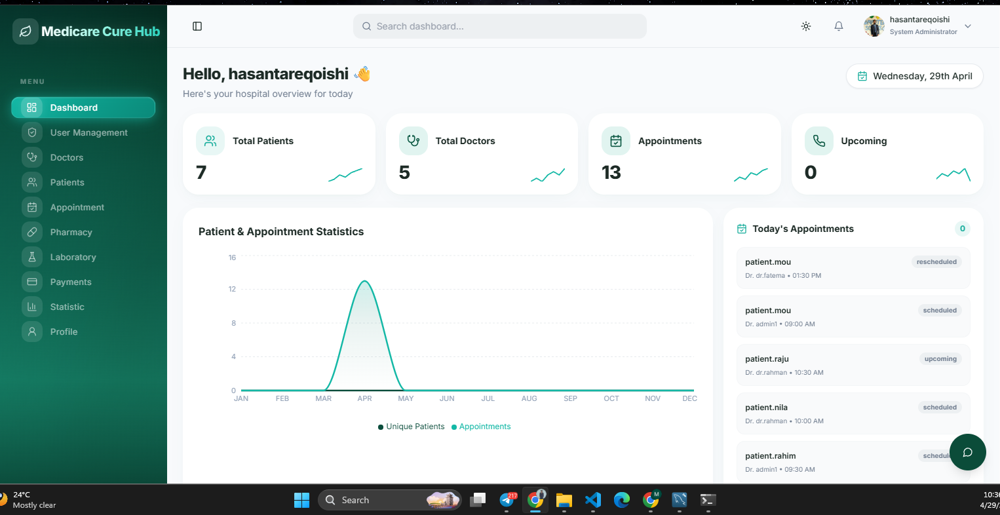
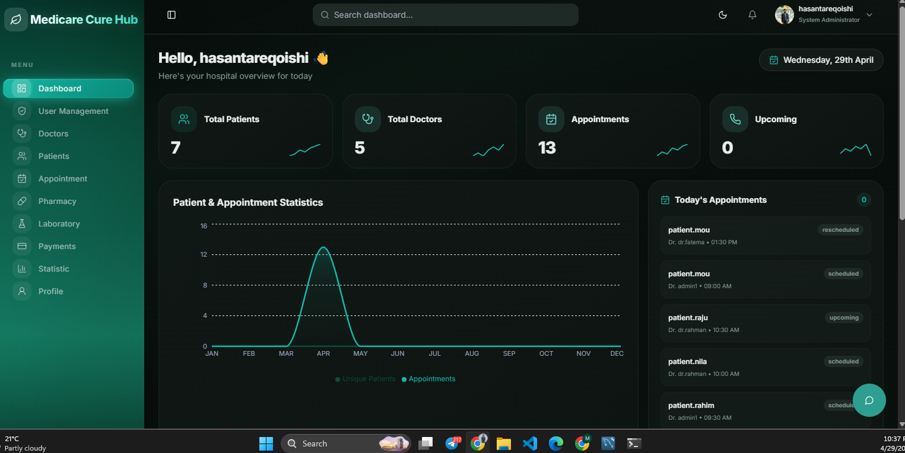
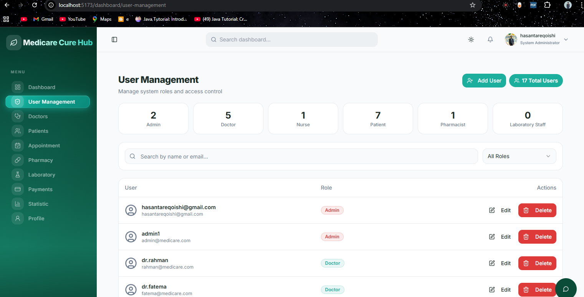
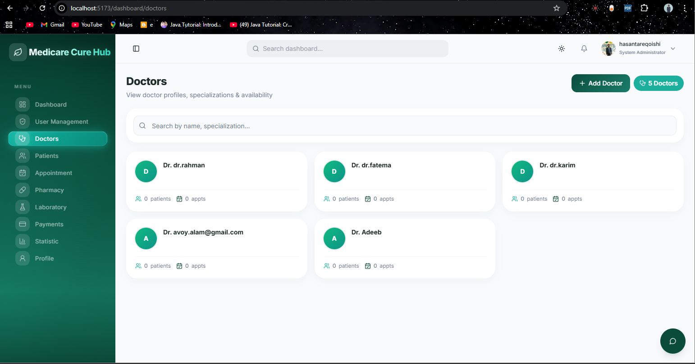
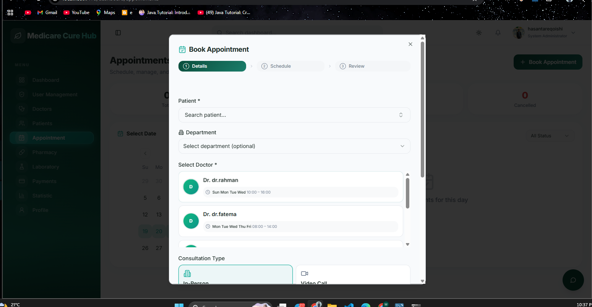
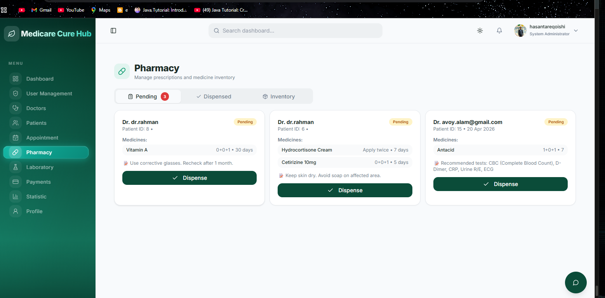
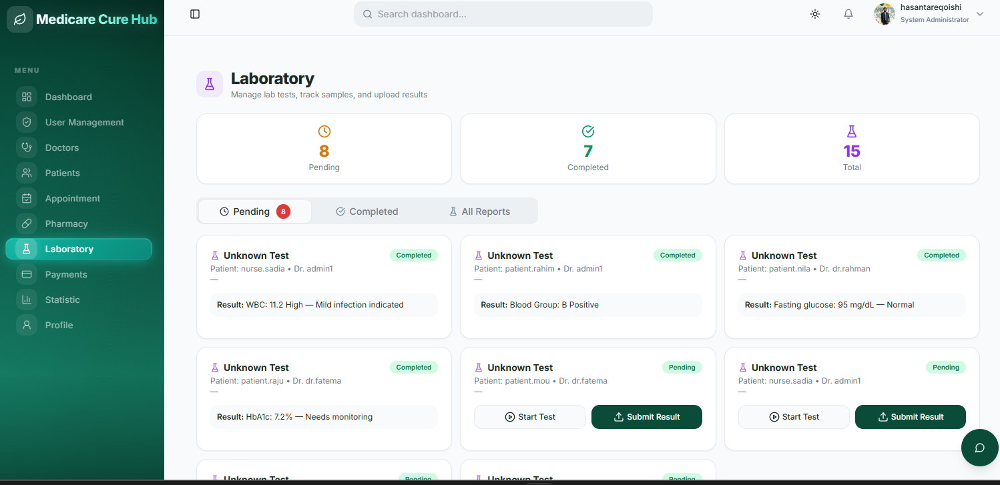
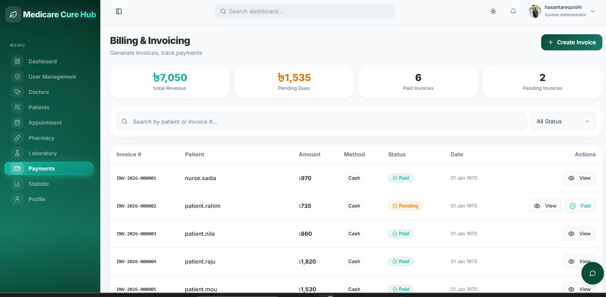
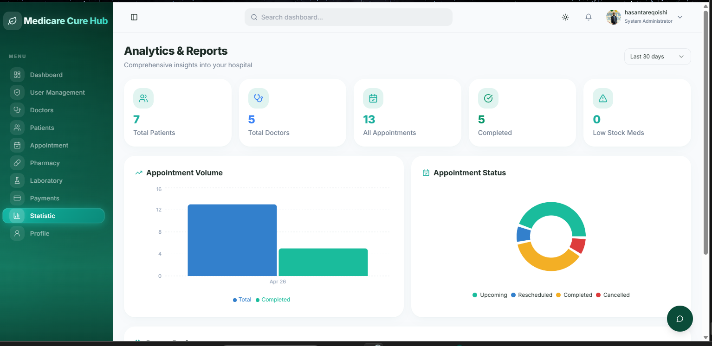
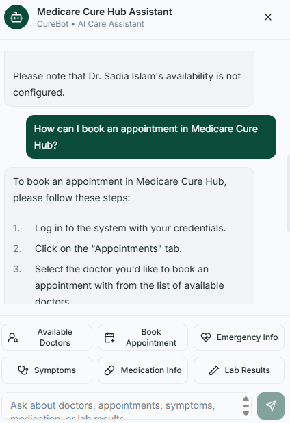

# 🏥 Medicare Cure Hub
### Production-Ready Hospital Management System

<p align="center">
  
  
  
  
  
  
</p>

---

## 🖥️ Dashboard Overview

Real-time hospital metrics, appointment tracking, and analytics — available in **light** and **dark** mode.

<p align="center">
  
  &nbsp;
  
</p>

---

## ✨ Core Features

Everything a modern hospital needs — built in one system.

| Module | Description |
|---|---|
| 👥 **User Management** | Role-based access control for 6 user types with full CRUD |
| 🔐 **JWT Authentication** | Spring Security-powered token auth with session management |
| 🩺 **Patient Management** | Full profiles, medical history, prescriptions & lab reports |
| 👨‍⚕️ **Doctor Management** | Availability scheduling, appointment conflicts, specializations |
| 📅 **Appointments** | Book, reschedule, cancel with conflict detection & calendar view |
| 💊 **Pharmacy** | Prescriptions, dispensing workflow, and inventory tracking |
| 🧪 **Laboratory** | Lab test requests, sample tracking, and result submission |
| 🧾 **Billing** | Invoice generation, payment status tracking in BDT (৳) |
| 🤖 **CureBot AI** | Groq-powered chatbot for FAQs, appointments & lab explanations |

---

## 📸 Module Screenshots

A tour of the key modules in action.

### 👤 User Management

<p align="center">
  
</p>

---

### 👨‍⚕️ Doctors &nbsp;&nbsp;&nbsp;&nbsp;&nbsp;&nbsp;&nbsp;&nbsp;&nbsp;&nbsp;&nbsp;&nbsp;&nbsp;&nbsp;&nbsp;&nbsp;&nbsp;&nbsp;&nbsp;&nbsp;&nbsp;&nbsp;&nbsp;&nbsp;&nbsp;&nbsp;&nbsp;&nbsp;&nbsp;&nbsp;&nbsp;&nbsp;&nbsp;&nbsp; 📅 Book Appointment

<p align="center">
  
  &nbsp;
  
</p>

---

### 💊 Pharmacy &nbsp;&nbsp;&nbsp;&nbsp;&nbsp;&nbsp;&nbsp;&nbsp;&nbsp;&nbsp;&nbsp;&nbsp;&nbsp;&nbsp;&nbsp;&nbsp;&nbsp;&nbsp;&nbsp;&nbsp;&nbsp;&nbsp;&nbsp;&nbsp;&nbsp;&nbsp;&nbsp;&nbsp;&nbsp;&nbsp;&nbsp;&nbsp;&nbsp;&nbsp;&nbsp;&nbsp;&nbsp;&nbsp; 🧪 Laboratory

<p align="center">
  
  &nbsp;
  
</p>

---

### 🧾 Billing & Invoicing &nbsp;&nbsp;&nbsp;&nbsp;&nbsp;&nbsp;&nbsp;&nbsp;&nbsp;&nbsp;&nbsp;&nbsp;&nbsp;&nbsp;&nbsp;&nbsp;&nbsp;&nbsp;&nbsp;&nbsp;&nbsp;&nbsp;&nbsp;&nbsp; 📊 Analytics & Reports

<p align="center">
  
  &nbsp;
  
</p>

---

## 🤖 CureBot — AI Care Assistant

Powered by Groq's `llama-3.1-8b-instant` model — answers medical FAQs, booking guidance, and lab result explanations in real-time.

<p align="center">
  
</p>

| Feature | Description |
|---|---|
| 🔍 **Doctor Availability** | Real-time availability queries with database integration |
| 📋 **Appointment Guidance** | Step-by-step booking help and scheduling advice |
| 🧬 **Lab Result Explanations** | Plain-language breakdown of test results for patients |
| 💡 **Medical FAQ** | General medication info and symptom guidance |

---

## 🛠️ Tech Stack

Modern, production-grade technologies across the full stack.

| Layer | Technologies |
|---|---|
| **Frontend** | React 18, TypeScript, Vite, Tailwind CSS, shadcn/ui, Radix UI |
| **Backend** | Spring Boot 3.2, Java 17, Spring Security, JWT, Spring Data JPA |
| **Database** | MySQL 8+, Hibernate ORM |
| **API Client** | Axios, TanStack Query |
| **AI Layer** | Groq API, llama-3.1-8b-instant, Spring RestTemplate |
| **Build Tools** | npm, Maven 3.9+ |

---

## 🚀 Quick Start

Get up and running in minutes.

### Prerequisites

```bash
# Required
Java 17+
Maven 3.9+
Node.js 18+
MySQL 8+

# Get free Groq API key at console.groq.com
```

### Backend

```bash
cd backend
mvn spring-boot:run
# Runs at http://localhost:8080
```

### Frontend

```bash
npm install
npm run dev
# Runs at http://localhost:5173
```

### Environment Config — `backend/src/main/resources/application.properties`

```properties
# MySQL
spring.datasource.url=jdbc:mysql://localhost:3306/medicare_hms?createDatabaseIfNotExist=true
spring.datasource.username=root
spring.datasource.password=your_mysql_password

# JWT
jwt.secret=replace_with_strong_secret_32_chars_minimum
jwt.expiration=86400000

# Groq AI
groq.api.key=your_groq_api_key_here
groq.model=llama-3.1-8b-instant
```

---

## 👥 User Roles & Permissions

Six distinct roles with carefully scoped access control.

| Role | Access |
|---|---|
| 👑 **Admin** | Full system access — users, doctors, patients, billing, analytics, and reports |
| 👨‍⚕️ **Doctor** | Assigned patients, appointments, prescriptions, lab report review |
| 🩺 **Nurse** | Patient and appointment workflow assistance |
| 🙋 **Patient** | Book appointments, view prescriptions, lab results, and medical history |
| 💊 **Pharmacist** | Medicine inventory management and prescription dispensing |
| 🧪 **Lab Staff** | Manage lab tests, process samples, and submit results |

---

## ⚠️ Known Issues & Fixes

> **Groq Model:** Use `llama-3.1-8b-instant` — the old `llama3-8b-8192` was retired in August 2025.

> **Backend Fix:** Add `@JsonIgnoreProperties(ignoreUnknown = true)` to all Groq response inner classes in `AIChatbotService.java`.

> **CureBot Connectivity:** If unreachable, verify backend internet access to `https://api.groq.com`.

> **Security:** Keep `application.properties` secrets out of git — add it to `.gitignore`.

---

## 📄 License

Released under the [MIT License](LICENSE).

---

<p align="center">
  🏥 <strong>Medicare Cure Hub</strong> — Hospital Management System
</p>
