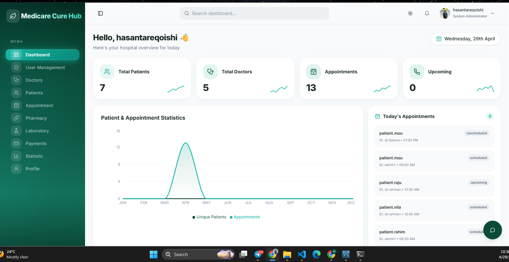
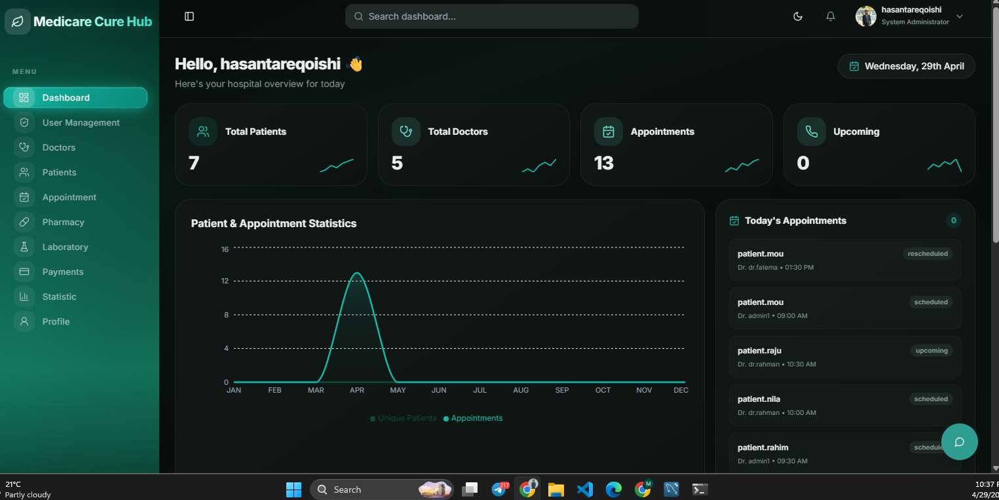
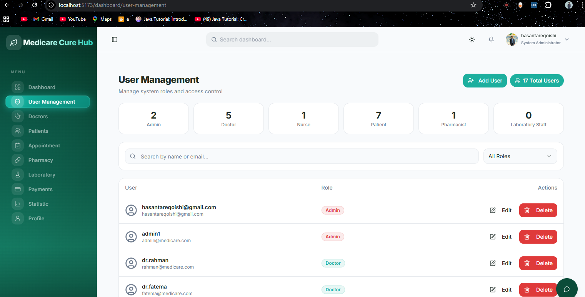
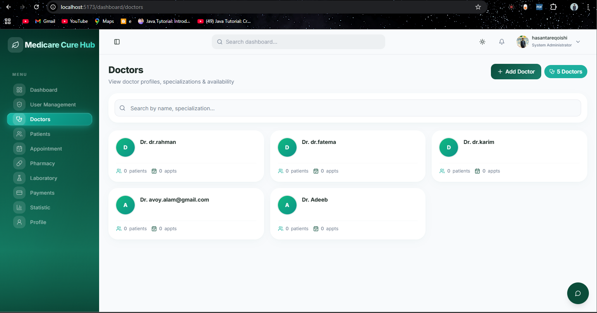
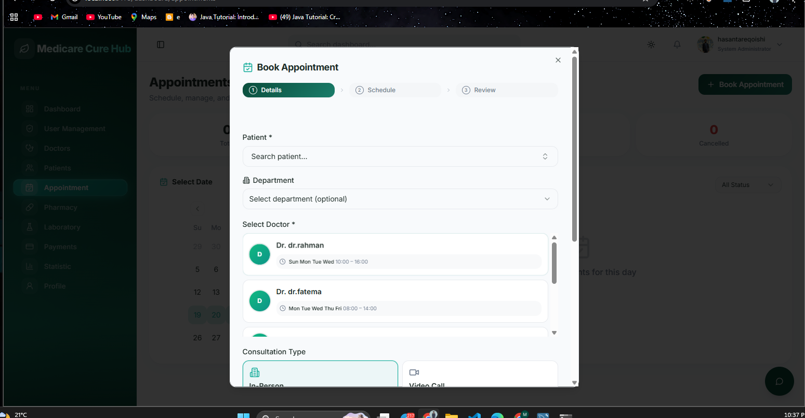
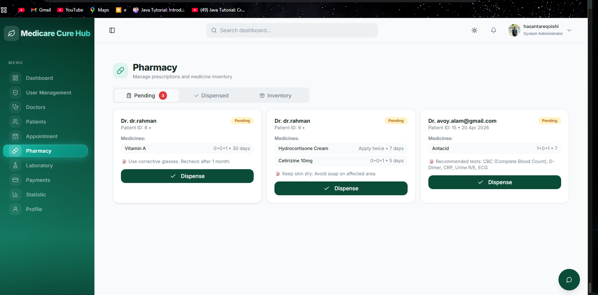
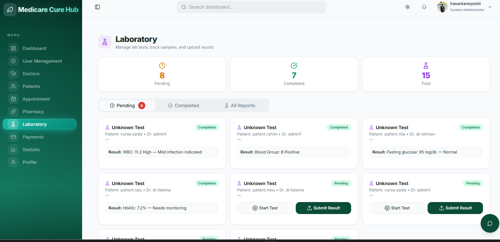
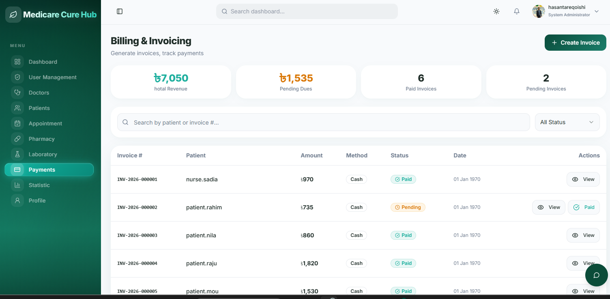
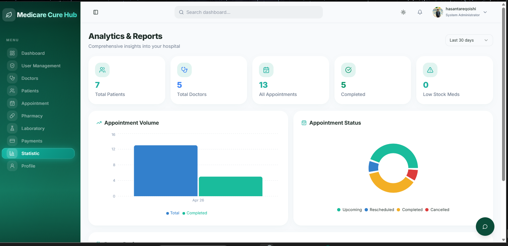
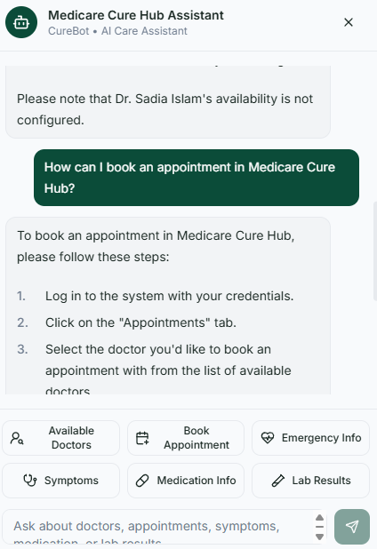

# Medicare Cure Hub

Production-ready Hospital Management System With AI.

<p align="center">
  
  
  
  
  
</p>

---

## Dashboard Overview

<p align="center">
  
  &nbsp;
  
</p>

---

## Core Features

| Module | Description |
|---|---|
| **User Management** | Role-based access control for 6 user types with full CRUD |
| **JWT Authentication** | Spring Security token auth with OAuth2 (Google) support |
| **Patient Management** | Full profiles, medical history, prescriptions & lab reports |
| **Doctor Management** | Availability scheduling, appointment conflicts, specializations |
| **Appointments** | Book, reschedule, cancel with conflict detection & notifications |
| **Pharmacy** | Prescriptions, dispensing workflow, and inventory tracking |
| **Laboratory** | Lab test requests, sample tracking, and result submission |
| **Billing** | Invoice generation, payment status tracking |
| **Notifications** | Real-time in-app notifications for all user actions |
| **CureBot AI** | Groq-powered chatbot for FAQs, appointments & lab explanations |

---

## Module Screenshots

### User Management

<p align="center">
  
</p>

---

### Doctors & Book Appointment

<p align="center">
  
  &nbsp;
  
</p>

---

### Pharmacy & Laboratory

<p align="center">
  
  &nbsp;
  
</p>

---

### Billing & Analytics

<p align="center">
  
  &nbsp;
  
</p>

---

## CureBot AI Assistant

Powered by Groq `llama-3.1-8b-instant` — answers medical FAQs, booking guidance, and lab result explanations.

<p align="center">
  
</p>

| Feature | Description |
|---|---|
| Doctor Availability | Real-time availability queries with database integration |
| Appointment Guidance | Step-by-step booking help and scheduling advice |
| Lab Result Explanations | Plain-language breakdown of test results for patients |
| Medical FAQ | General medication info and symptom guidance |

---

## System Architecture

```
┌─────────────────────┐
│  React 18 Frontend  │
│  (localhost:5173)   │
└──────────┬──────────┘
           │ HTTP/REST
           │ Axios + React Query
           ▼
┌─────────────────────┐
│ Spring Boot Backend │
│ (localhost:8080)    │
└──────────┬──────────┘
           │ JDBC/JPA
           ▼
    ┌─────────────┐
    │   MySQL 8   │
    │  Database   │
    └─────────────┘
```

---

## Tech Stack

| Layer | Technologies |
|---|---|
| **Frontend** | React 18, TypeScript, Vite, Tailwind CSS, shadcn/ui, Radix UI |
| **Backend** | Spring Boot 3.2, Java 17, Spring Security, JWT, Spring Data JPA |
| **Database** | MySQL 8+, Hibernate ORM (ddl-auto=update) |
| **API Client** | Axios, TanStack Query |
| **AI Layer** | Groq API, llama-3.1-8b-instant, Spring RestTemplate |
| **File Storage** | Cloudinary (lab reports, avatars) |
| **Build Tools** | npm, Maven 3.9+ |

---

## Project Structure

```
health-hub-main/
├── backend/                            # Spring Boot Backend
│   ├── src/main/java/com/medicare/hms/
│   │   ├── controller/                 # 14 REST Controllers
│   │   ├── service/                    # 12 Business Logic Services
│   │   ├── entity/                     # 13 JPA Entities + 6 Enums
│   │   ├── repository/                 # Spring Data JPA Repos
│   │   ├── dto/                        # Request/Response DTOs
│   │   ├── security/                   # JWT, SecurityConfig, OAuth2
│   │   ├── config/                     # Cloudinary Config
│   │   └── exception/                  # Global Exception Handler
│   ├── src/main/resources/
│   │   └── application.properties
│   └── pom.xml
│
├── src/                                # React Frontend
│   ├── api/                            # Axios API Services + React Query
│   ├── components/
│   │   ├── appointments/               # BookAppointment, AvailabilitySettings
│   │   ├── patients/                   # PatientDetail, PrescriptionForm, Registration
│   │   ├── users/                      # AddUserDialog
│   │   ├── ui/                         # shadcn/ui Components
│   │   ├── AIChatbot.tsx
│   │   ├── AppSidebar.tsx
│   │   ├── DashboardLayout.tsx
│   │   ├── NotificationBell.tsx
│   │   └── ...
│   ├── pages/                          # 16 Page Components
│   │   ├── Auth.tsx, LandingPage.tsx
│   │   ├── Index.tsx (Admin Dashboard)
│   │   ├── PatientDashboard.tsx, DoctorDashboard.tsx
│   │   ├── Appointments.tsx, Patients.tsx, Doctors.tsx
│   │   ├── Pharmacy.tsx, Laboratory.tsx, Billing.tsx
│   │   ├── Analytics.tsx, Profile.tsx, UserManagement.tsx
│   │   └── ...
│   ├── contexts/                       # AuthContext
│   ├── hooks/                          # Custom Hooks
│   ├── lib/                            # Utilities (pdfUtils, utils)
│   └── main.tsx
│
├── database/
│   ├── SCHEMA.md                       # Current DB Schema (authoritative)
│   └── dummy_data.sql                  # Sample Test Data
│
├── public/                             # Static Assets
├── screenshots/                        # Module Screenshots
├── package.json
├── vite.config.ts
├── tailwind.config.ts
└── README.md
```

---

## Quick Start

### Prerequisites

```
Java 17+
Maven 3.9+
Node.js 18+
MySQL 8+
```

### Backend

```bash
cd backend
mvn spring-boot:run
# Runs at http://localhost:8080
```

### Frontend

```bash
npm install
npm run dev
# Runs at http://localhost:5173
```

### Environment Variables

**`backend/src/main/resources/application.properties`**

```properties
# MySQL
spring.datasource.url=jdbc:mysql://localhost:3306/medicare_hms?createDatabaseIfNotExist=true
spring.datasource.username=root
spring.datasource.password=your_mysql_password

# JWT
jwt.secret=replace_with_strong_secret_32_chars_minimum
jwt.expiration=86400000

# Groq AI
groq.api.key=your_groq_api_key_here
groq.model=llama-3.1-8b-instant
```

**`.env` (root — for Cloudinary)**

```
VITE_CLOUDINARY_CLOUD_NAME=your_cloud_name
VITE_CLOUDINARY_UPLOAD_PRESET=your_preset
```

---

## User Roles & Permissions

| Role | Access |
|---|---|
| **Admin** | Full system access — users, doctors, patients, billing, analytics, reports |
| **Doctor** | Assigned patients, appointments, prescriptions, lab test orders |
| **Nurse** | Patient and appointment workflow assistance |
| **Patient** | Book appointments, view prescriptions, lab results, medical history |
| **Pharmacist** | Medicine inventory management and prescription dispensing |
| **Lab Staff** | Manage lab tests, process samples, and submit results |

---

## Database

See [`database/SCHEMA.md`](database/SCHEMA.md) for the full schema reference.

13 tables: `users`, `profiles`, `appointments`, `medical_records`, `prescriptions`, `medicines`, `lab_tests`, `test_reports`, `lab_reports`, `billing_invoices`, `notifications`, `doctor_availability`, `roles`.

---

## License

Released under the [MIT License](LICENSE).
